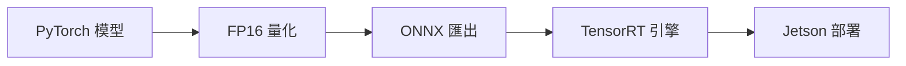

# Jetson Orin Nano 部署指南

**目標平台**: NVIDIA Jetson Orin Nano 8GB
**作業系統**: JetPack 5.x
**日期**: 2026-01-20

---

## 📋 目錄

1. [硬體需求](#硬體需求)
2. [環境設置](#環境設置)
3. [模型優化](#模型優化)
4. [部署流程](#部署流程)
5. [效能調優](#效能調優)
6. [監控與除錯](#監控與除錯)
7. [常見問題](#常見問題)

---

## 🖥️ 硬體需求

### 最低配置

| 項目 | 規格 |
|------|------|
| **開發板** | Jetson Orin Nano 8GB |
| **JetPack** | 5.1.2 或更高版本 |
| **儲存空間** | ≥ 64GB (建議 128GB NVMe SSD) |
| **電源** | 15W 或 25W 模式 (建議 25W) |
| **散熱** | 主動散熱風扇 (必要) |
| **相機** | ORBBEC Gemini 2 RGB-D Camera |

### 建議配置

- **記憶體**: 8GB (標配)
- **Swap**: 8GB (需額外配置)
- **散熱**: PWM 風扇 + 導熱墊
- **儲存**: 128GB+ NVMe SSD (M.2 2280)

---

## 🔧 環境設置

### 1. 安裝 JetPack

1. 下載 JetPack SDK Manager:
   ```bash
   # 從 NVIDIA 開發者網站下載
   # https://developer.nvidia.com/embedded/jetpack
   ```

2. 刷入 Jetson Orin Nano:
   ```bash
   # 依照官方文檔操作
   # 需要 Host PC (Ubuntu 18.04/20.04/22.04)
   ```

3. 驗證安裝:
   ```bash
   jetson_release -v
   # 確認 JetPack 版本 ≥ 5.1
   ```

### 2. 執行自動設置腳本

```bash
cd deployment/jetson
chmod +x setup_jetson.sh
./setup_jetson.sh
```

腳本會自動執行:
- ✅ 系統更新
- ✅ 安裝 Python 依賴
- ✅ 安裝 PyTorch for Jetson
- ✅ 配置 swap 空間 (8GB)
- ✅ 設置最大效能模式
- ✅ 安裝監控工具 (jtop)

### 3. 手動安裝步驟 (進階)

#### 安裝 PyTorch

```bash
# PyTorch for Jetson (JetPack 5.x)
wget https://nvidia.box.com/shared/static/[version].whl
pip3 install torch-*.whl

# 驗證
python3 -c "import torch; print(torch.__version__); print(torch.cuda.is_available())"
```

#### 安裝 TensorRT

TensorRT 通常隨 JetPack 預裝:

```bash
# 驗證 TensorRT
python3 -c "import tensorrt as trt; print(trt.__version__)"

# 如果缺少 Python bindings:
cd /usr/src/tensorrt/samples/python/
pip3 install python3-libnvinfer
```

#### 配置 Swap

```bash
# 建立 8GB swap
sudo fallocate -l 8G /swapfile
sudo chmod 600 /swapfile
sudo mkswap /swapfile
sudo swapon /swapfile

# 永久啟用
echo '/swapfile none swap sw 0 0' | sudo tee -a /etc/fstab

# 驗證
free -h
```

---

## ⚡ 模型優化

### 優化流程



### 1. FP16 量化

```python
from deployment.jetson.model_optimizer import ModelOptimizer

optimizer = ModelOptimizer()

# 轉換為 FP16
model_fp16 = optimizer.convert_to_fp16(
    model,
    save_path="models/model_fp16.pth"
)
```

**效果**: 記憶體減半, 速度提升 1.5-2x

### 2. ONNX 匯出

```python
# 匯出 ONNX
optimizer.export_to_onnx(
    model,
    input_shape=(1, 3, 224, 224),
    onnx_path="models/model.onnx",
    opset_version=13
)
```

### 3. TensorRT 轉換

```python
# 轉換 TensorRT 引擎
optimizer.convert_to_tensorrt(
    onnx_path="models/model.onnx",
    engine_path="models/model_fp16.engine",
    precision="fp16",
    workspace_size=2,  # GB
    max_batch_size=1
)
```

**效果**: 速度提升 2-3x (相比 FP16)

### 優化對比

| 版本 | 記憶體 | 速度 | 精度 | 建議 |
|------|--------|------|------|------|
| **FP32** | 100% | 基準 | 最高 | 開發測試 |
| **FP16** | 50% | 1.5-2x | 接近 | ⭐️ 平衡模式 |
| **INT8** | 25% | 3-4x | 略降 | 極致效能 |
| **TensorRT FP16** | 50% | 2-3x | 接近 | ⭐️ 生產部署 |

---

## 🚀 部署流程

### 1. 準備模型檔案

```bash
# 目錄結構
deployment/
├── jetson/
│   ├── setup_jetson.sh
│   ├── model_optimizer.py
│   └── resource_monitor.py
└── models/
    ├── yolo11n_fp16.engine       # 物件檢測
    ├── segmentation_fp16.engine  # 分割
    └── config.json               # 配置
```

### 2. 配置系統

```python
# config.json
{
  "camera": {
    "width": 1280,
    "height": 800,
    "fps": 30
  },
  "models": {
    "detection": "models/yolo11n_fp16.engine",
    "segmentation": "models/segmentation_fp16.engine"
  },
  "performance": {
    "mode": "balanced",  # high_quality, balanced, high_speed
    "subsample": 4,
    "enable_temporal_filter": true
  }
}
```

### 3. 執行系統

```bash
# 設置效能模式
sudo nvpmodel -m 0  # 最大效能
sudo jetson_clocks   # 鎖定時脈

# 執行檢測系統
python3 scripts/demo_e2e.py --config deployment/config.json
```

### 4. 效能監控

```bash
# 終端 1: 執行系統
python3 scripts/demo_e2e.py

# 終端 2: 監控資源
python3 deployment/jetson/resource_monitor.py

# 或使用 jtop
sudo jtop
```

---

## 🎯 效能調優

### 效能模式設定

Jetson Orin Nano 有 2 種效能模式:

| 模式 | 功率 | 效能 | 建議使用 |
|------|------|------|----------|
| **Mode 0** (MAXN) | 25W | 最高 | ⭐️ 生產環境 |
| **Mode 1** (15W) | 15W | 中等 | 開發測試 |

```bash
# 查看當前模式
sudo nvpmodel -q

# 設置最大效能模式
sudo nvpmodel -m 0

# 鎖定時脈 (避免降頻)
sudo jetson_clocks

# 設置風扇為最大轉速
sudo jetson_clocks --fan
```

### 系統優化建議

#### 1. 記憶體優化

```python
# 使用 FP16 模型
model = model.half()

# 減少批次大小
batch_size = 1

# 使用梯度檢查點 (如果訓練)
torch.utils.checkpoint.checkpoint(...)
```

#### 2. 影像處理優化

```python
from src.processing import PerformanceOptimizer

optimizer = PerformanceOptimizer()

# 快速濾波
depth_filtered = optimizer.fast_bilateral_filter(depth, d=5)

# 時域濾波
depth_filtered = optimizer.temporal_filter(depth_filtered, alpha=0.7)

# 自適應降採樣
subsample = optimizer.adaptive_subsample(depth, target_points=30000)
points = optimizer.fast_pointcloud_generation(
    depth, fx, fy, cx, cy, subsample=subsample
)
```

#### 3. 多執行緒優化

```python
import threading
from queue import Queue

# 相機執行緒
def camera_thread(queue):
    while True:
        frame = camera.get_frame()
        queue.put(frame)

# 處理執行緒
def processing_thread(queue):
    while True:
        frame = queue.get()
        result = process(frame)
```

### 預期效能

#### 最佳化配置 (FP16 + TensorRT)

| 模組 | 耗時 | FPS |
|------|------|-----|
| **相機擷取** | ~30 ms | 33 |
| **AI 推理** (YOLOv11n FP16) | ~15 ms | 67 |
| **點雲生成** (subsample 4x) | ~5 ms | 200 |
| **量測 + 決策** | ~10 ms | 100 |
| **總計** | ~60 ms | **15-20 FPS** |

#### 平衡配置 (FP16 無 TensorRT)

| 模組 | 耗時 | FPS |
|------|------|-----|
| **相機擷取** | ~30 ms | 33 |
| **AI 推理** (FP16) | ~40 ms | 25 |
| **點雲生成** | ~5 ms | 200 |
| **量測 + 決策** | ~10 ms | 100 |
| **總計** | ~85 ms | **10-12 FPS** |

---

## 📊 監控與除錯

### 使用資源監控器

```bash
# 執行監控器
python3 deployment/jetson/resource_monitor.py

# 連續監控 60 秒
python3 -c "
from deployment.jetson.resource_monitor import ResourceMonitor
monitor = ResourceMonitor()
monitor.monitor_continuous(duration=60, interval=1.0)
"
```

### 使用 jtop

```bash
# 安裝
sudo pip3 install jetson-stats

# 執行
sudo jtop

# 快捷鍵:
# 1: 系統資訊
# 2: CPU/GPU 使用率
# 3: 記憶體
# 4: 溫度
# 5: 功率
```

### 效能分析

```python
from src.processing import Timer

with Timer() as t:
    result = model(input_data)
print(f"推理時間: {t.elapsed*1000:.2f} ms")

# 詳細分析
import torch.profiler as profiler

with profiler.profile() as prof:
    model(input_data)

prof.export_chrome_trace("trace.json")
# 在 chrome://tracing 查看
```

### 常見效能問題

#### 1. CPU/GPU 使用率低

```bash
# 檢查是否啟用最大效能模式
sudo nvpmodel -q

# 鎖定時脈
sudo jetson_clocks
```

#### 2. 記憶體不足

```bash
# 檢查 swap
free -h

# 增加 swap
sudo swapoff /swapfile
sudo fallocate -l 16G /swapfile
sudo mkswap /swapfile
sudo swapon /swapfile
```

#### 3. 過熱降頻

```bash
# 檢查溫度
sudo jtop  # 查看溫度

# 確保散熱
# - 確認風扇運作
# - 清理灰塵
# - 更換導熱墊
```

---

## ❓ 常見問題

### Q1: PyTorch 安裝失敗?

**A**: 確保使用 Jetson 專用的 PyTorch wheel:

```bash
# 從 NVIDIA 論壇下載對應 JetPack 版本的 wheel
# https://forums.developer.nvidia.com/t/pytorch-for-jetson/72048

# 不要使用 pip install torch
pip3 install torch-*.whl
```

### Q2: TensorRT 引擎建立失敗?

**A**: 檢查:
1. ONNX 模型是否正確匯出
2. workspace_size 是否足夠
3. 記憶體是否充足 (考慮增加 swap)

```bash
# 增加 swap
sudo fallocate -l 16G /swapfile
```

### Q3: 相機無法連接?

**A**: 確認:
```bash
# 檢查 USB 裝置
lsusb | grep Orbbec

# 檢查權限
sudo chmod 666 /dev/bus/usb/*/*

# 安裝驅動
# 參考 ORBBEC SDK 文檔
```

### Q4: 效能不如預期?

**A**: 檢查列表:
- [ ] 是否使用 FP16/TensorRT
- [ ] 效能模式是否設為 MAXN
- [ ] 是否有過熱降頻
- [ ] 記憶體是否充足
- [ ] 是否使用自適應降採樣

### Q5: 如何進一步提升效能?

**A**: 優化策略:
1. **INT8 量化** (需要校準資料)
2. **模型剪枝** (減少參數量)
3. **知識蒸餾** (使用更小的模型)
4. **多執行緒** (相機與推理並行)
5. **批次處理** (累積多幀一起處理)

---

## 📝 部署檢查清單

- [ ] JetPack 5.x 已安裝
- [ ] Python 環境已配置
- [ ] PyTorch for Jetson 已安裝
- [ ] TensorRT 可用
- [ ] Swap 空間 ≥ 8GB
- [ ] 效能模式設為 MAXN
- [ ] 風扇正常運作
- [ ] 模型已轉換為 FP16/TensorRT
- [ ] 相機驅動已安裝
- [ ] 測試程式正常運作
- [ ] 資源監控工具可用
- [ ] 效能符合預期 (≥15 FPS)

---

## 📚 參考資料

- [NVIDIA Jetson Orin Nano 文檔](https://developer.nvidia.com/embedded/jetson-orin-nano-developer-kit)
- [JetPack SDK](https://developer.nvidia.com/embedded/jetpack)
- [PyTorch for Jetson](https://forums.developer.nvidia.com/t/pytorch-for-jetson/72048)
- [TensorRT 文檔](https://docs.nvidia.com/deeplearning/tensorrt/)
- [jetson-stats](https://github.com/rbonghi/jetson_stats)

---

**文檔版本**: 1.0
**最後更新**: 2026-01-20
**作者**: Claude Sonnet 4.5 + Happy
